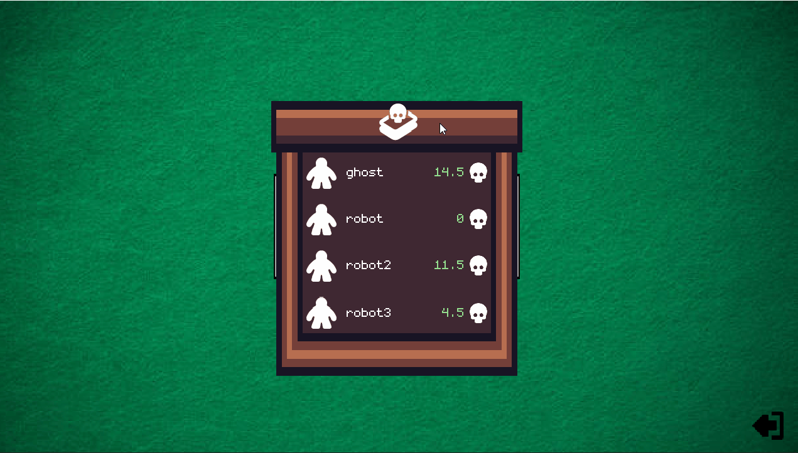

# Veneno - playing card game
Use this Godot 4 project as inspiration for your card games or simply have a game. For now, you can only play against the AI, and multiplayer is not implemented yet.

- Number of players 2 ~ 4
- French or Spanish deck
- Average playtime: 5 min

## Rules
- Each player is dealt 4 cards. There are 3 spaces on the table to place cards of the same suit.
- At the beginning of their turn, a player selects a card from their hand to place on the table.
- If there is already a card of the same suit on the table, the player places their card next to it.
- If there isn't a card of the same suit on the table, the player places it in an empty space.
- Cards from the "hearts" suit in french deck or "cups" on spanish deck can be placed next to cards of any suit.
- If a player places a card that makes the sum of the values equal to or greater than 13 points, they collect the cards and add them to their capture pile.
- A player's turn ends after they place a card on the table

# How do you win?
The player with the fewest poison points at the end of the game.

# Example game

# End screen

